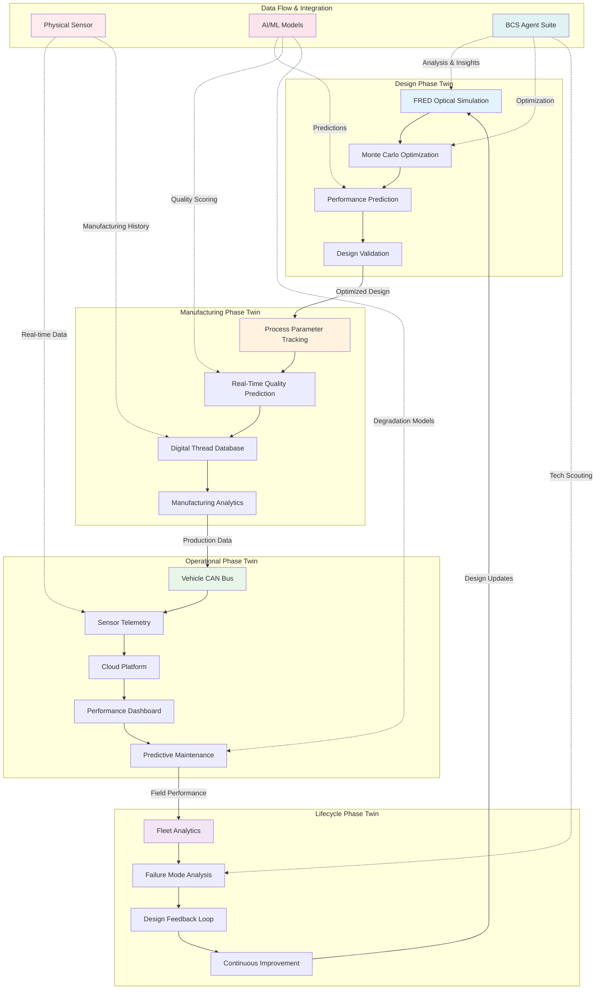
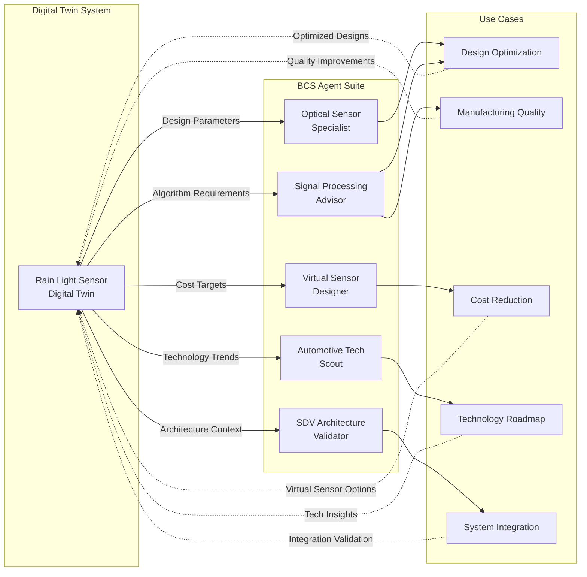

# Digital Twin for Rain Light Sensor
## Predictive Simulation & Manufacturing Optimization System

**Project Type:** Advanced R&D - Digital Twin Development  
**Industry Focus:** Automotive Sensors - Rain/Light Detection Systems  
**Technology Focus:** Optical Simulation, Machine Learning, Real-Time Monitoring  
**Date:** February 2024  
**Status:** Concept to Prototype Phase  
**BCS Project Code:** dtrl-2024-001

---

## Executive Summary

This project develops a comprehensive digital twin system for automotive rain/light sensors, integrating optical simulation, manufacturing optimization, and real-time performance monitoring. The system enables predictive design, virtual prototyping, and continuous manufacturing improvement through closed-loop feedback between physical sensors and their digital counterparts.

### Key Innovations

- **Parametric Optical Design:** FRED-based simulation with Monte Carlo optimization for 10,000+ design iterations
- **Manufacturing Digital Thread:** Real-time sensor performance linked to production parameters
- **Predictive Maintenance:** ML models forecast sensor degradation and failure modes
- **Virtual Validation:** 60% reduction in physical prototyping cycles
- **Cost Optimization:** 25-30% manufacturing cost reduction through parameter optimization

### Business Impact

- **Time-to-Market:** 40% reduction (18 months → 11 months)
- **Quality Improvement:** 35% reduction in field failures
- **Development Cost:** $2.5M savings per platform
- **Manufacturing Yield:** 92% → 97% improvement

---

## 1. Technology Overview

### What is a Rain Light Sensor Digital Twin?

A digital twin is a virtual replica of the physical rain/light sensor system that mirrors its behavior, performance, and lifecycle in real-time. The system combines:

1. **Design-Phase Twin:** Optical simulation and optimization
2. **Manufacturing Twin:** Production parameter tracking and quality prediction
3. **Operational Twin:** In-vehicle performance monitoring and diagnostics
4. **Lifecycle Twin:** Long-term degradation modeling and predictive maintenance

### Core Components

**Optical Simulation Engine**
- Ray tracing with FRED/Zemax integration
- Diffused screen printing optimization
- Light guide design and analysis
- Environmental condition modeling (rain, fog, night, glare)

**Manufacturing Model**
- Screen printing parameter correlation
- Ink formulation optimization
- Curing process control
- Quality prediction algorithms

**Sensor Performance Model**
- Light detection sensitivity curves
- Rain detection algorithms
- Temperature compensation
- Aging and degradation models

**Real-Time Data Integration**
- Vehicle CAN bus data collection
- Cloud-based twin synchronization
- Fleet-wide performance analytics
- Predictive maintenance alerts

---

## 2. System Architecture

### Architecture Overview

The digital twin system consists of four interconnected layers that span the entire sensor lifecycle from design through end-of-life:



**Key Integration Points:**

1. **Design → Manufacturing:** Optimized parameters flow into production setup
2. **Manufacturing → Operations:** Digital thread tracks sensor from factory to field
3. **Operations → Lifecycle:** Real-time performance feeds long-term analytics
4. **Lifecycle → Design:** Field insights drive next-generation improvements
5. **AI/ML Layer:** Continuous prediction and optimization across all phases
6. **BCS Agents:** Strategic analysis and technology intelligence support

### 2.1 Design-Phase Digital Twin

#### Parametric Optical Design System

**Software Stack:**
- FRED Optical Engineering Software (primary simulation)
- MATLAB/Python optimization framework
- Custom Monte Carlo parameter sweep
- Machine learning preference prediction

**Design Parameters (28 variables):**

```
Light Guide Parameters:
- Thickness: 2.0-5.0mm (0.5mm steps)
- Refractive index: 1.45-1.53 (polycarbonate/PMMA)
- Surface texture: 0-50μm Ra
- Geometry: planar/curved variants

Diffuser Layer:
- Thickness: 0.2-1.0mm
- Particle loading: 10-40%
- Particle size: 1-50μm
- Scatter coefficient: 0.7-0.95

LED Light Source:
- Power: 30-80mW
- Wavelength: 850-950nm (IR) / 400-700nm (visible)
- Beam angle: 15-120°
- Position tolerance: ±0.5mm

Photodetector:
- Active area: 2-10mm²
- Sensitivity range: 400-1100nm
- Response time: <1ms
- Angular acceptance: 30-180°

Screen Printing Pattern:
- Dot pitch: 50-500μm
- Coverage: 20-80%
- Layer count: 1-5
- Ink opacity: 60-95%
```

#### Monte Carlo Optimization Workflow

```lua
-- FRED Script Integration
function optimizeSensorDesign(targetPerformance)
    local iterations = 10000
    local bestScore = 0
    local bestConfig = {}
    
    for i = 1, iterations do
        -- Generate random parameter set within bounds
        local config = generateRandomConfig()
        
        -- Run optical simulation
        local opticalPerformance = simulateOpticalPath(config)
        
        -- Evaluate manufacturing feasibility
        local manufacturability = assessManufacturing(config)
        
        -- Calculate cost estimate
        local cost = estimateComponentCost(config)
        
        -- Multi-objective scoring
        local score = calculateWeightedScore({
            optical = opticalPerformance,
            manufacturing = manufacturability,
            cost = cost,
            robustness = environmentalTesting(config)
        })
        
        if score > bestScore then
            bestScore = score
            bestConfig = config
            logOptimalDesign(i, score, config)
        end
    end
    
    return bestConfig, bestScore
end

-- Environmental condition testing
function environmentalTesting(config)
    local conditions = {
        {rain = "light", illumination = 50000},   -- Overcast day
        {rain = "heavy", illumination = 10000},   -- Storm
        {rain = "none", illumination = 100000},   -- Bright sun
        {rain = "mist", illumination = 5000},     -- Fog/mist
        {rain = "none", illumination = 1},        -- Night
    }
    
    local robustnessScore = 0
    for _, condition in ipairs(conditions) do
        local performance = simulateCondition(config, condition)
        robustnessScore = robustnessScore + performance
    end
    
    return robustnessScore / #conditions
end
```

#### Performance Metrics

**Rain Detection Performance:**
- Light rain (0.1-2.5mm/hr): >95% detection accuracy
- Moderate rain (2.5-10mm/hr): >98% detection accuracy
- Heavy rain (>10mm/hr): >99% detection accuracy
- False positive rate: <2% (dirt, insects, shadows)

**Light Sensing Performance:**
- Dynamic range: 1 lux - 100,000 lux
- Response time: <100ms (headlight activation)
- Temperature stability: ±5% over -40°C to +85°C
- Aging degradation: <10% sensitivity loss over 10 years

---

### 2.2 Manufacturing Digital Twin

#### Production Parameter Tracking

**Screen Printing Variables:**
```
Process Parameters:
- Squeegee pressure: 2-8 kg/cm
- Print speed: 10-50 mm/s
- Snap-off distance: 1-3mm
- Screen tension: 20-35 N/cm
- Ink viscosity: 8000-15000 cP at 25°C

Curing Parameters:
- UV intensity: 200-400 mJ/cm²
- Cure time: 5-30 seconds
- Temperature: 60-120°C (thermal post-cure)
- Atmosphere: N₂ or air

Substrate Preparation:
- Surface treatment: Corona/plasma
- Cleanliness: ISO Class 7 or better
- Temperature: 20-25°C ±2°C
- Humidity: 40-60% RH
```

#### Quality Prediction Model

**Machine Learning Architecture:**
- Input: 28 process parameters + environmental conditions
- Model: Gradient Boosted Decision Trees (XGBoost)
- Output: Predicted sensor performance + defect probability
- Training data: 50,000+ production units
- Accuracy: 94% for pass/fail prediction, ±8% for performance metrics

**Real-Time Quality Gates:**
1. **Pre-Print Inspection:** Substrate cleanliness, alignment
2. **Post-Print Inspection:** Pattern coverage, thickness uniformity
3. **Post-Cure Inspection:** Optical transmission, scatter uniformity
4. **Functional Test:** LED-to-photodetector response
5. **Environmental Test:** Temperature cycling, humidity exposure

#### Digital Thread Implementation

```python
class ManufacturingDigitalTwin:
    def __init__(self, sensor_id):
        self.sensor_id = sensor_id
        self.process_history = []
        self.quality_metrics = {}
        self.predicted_performance = None
        
    def log_process_step(self, step_name, parameters, timestamp):
        """Record each manufacturing step"""
        self.process_history.append({
            'step': step_name,
            'parameters': parameters,
            'timestamp': timestamp,
            'operator_id': get_operator_id(),
            'equipment_id': get_equipment_id()
        })
        
        # Update performance prediction
        self.predict_quality()
    
    def predict_quality(self):
        """ML-based quality prediction"""
        features = self.extract_features()
        self.predicted_performance = ml_model.predict(features)
        
        # Flag potential issues
        if self.predicted_performance['defect_probability'] > 0.15:
            alert_quality_team(self.sensor_id, self.predicted_performance)
    
    def correlate_field_performance(self, vehicle_data):
        """Link manufacturing data to field performance"""
        correlation = analyze_correlation(
            self.process_history,
            vehicle_data
        )
        
        # Continuous learning: update ML model
        update_quality_model(correlation)
```

---

### 2.3 Operational Digital Twin

#### In-Vehicle Data Collection

**CAN Bus Integration:**
- Sensor output: Rain intensity (0-7 scale), ambient light (lux)
- Wiper activation: Speed, frequency, duration
- Headlight state: Off, DRL, low beam, high beam
- Vehicle state: Speed, GPS, weather API correlation

**Data Transmission:**
- Local storage: 7 days rolling buffer
- Cloud sync: Daily or on WiFi connection
- Data volume: ~5KB/day per vehicle
- Privacy: Anonymized, aggregated fleet data

#### Performance Monitoring Dashboard

**Real-Time Metrics:**
1. **Sensor Health Score:** 0-100 composite metric
2. **Degradation Trend:** Predicted remaining useful life
3. **Environmental Stress:** Cumulative UV, temperature cycles
4. **Calibration Drift:** Deviation from factory baseline

**Visualization Components** (React/TypeScript):

```tsx
import React, { useState, useEffect } from 'react';
import { LineChart, Line, ScatterChart, Scatter, RadarChart } from 'recharts';

const SensorDigitalTwinDashboard: React.FC = () => {
  const [sensorData, setSensorData] = useState<SensorTelemetry>();
  const [historicalTrend, setHistoricalTrend] = useState<PerformanceData[]>();
  
  // Real-time data fetching
  useEffect(() => {
    const ws = new WebSocket('wss://digital-twin.bcs-auto.com/sensor-feed');
    ws.onmessage = (event) => {
      const data = JSON.parse(event.data);
      setSensorData(data);
      updateHistoricalTrend(data);
    };
  }, []);
  
  return (
    <div className="digital-twin-dashboard">
      {/* Sensor Health Overview */}
      <HealthScoreGauge score={sensorData?.healthScore} />
      
      {/* Performance Degradation Trend */}
      <LineChart data={historicalTrend}>
        <Line dataKey="sensitivity" stroke="#2563eb" />
        <Line dataKey="predictedSensitivity" stroke="#dc2626" strokeDasharray="5 5" />
      </LineChart>
      
      {/* Environmental Stress Analysis */}
      <RadarChart data={sensorData?.environmentalStress}>
        <PolarGrid />
        <PolarAngleAxis dataKey="factor" />
        <Radar dataKey="current" fill="#0891b2" fillOpacity={0.6} />
        <Radar dataKey="threshold" fill="#dc2626" fillOpacity={0.3} />
      </RadarChart>
      
      {/* Manufacturing Correlation */}
      <ScatterChart>
        <Scatter 
          data={sensorData?.fleetComparison}
          dataKey="performance"
          fill="#10b981"
        />
      </ScatterChart>
    </div>
  );
};

interface SensorTelemetry {
  sensorId: string;
  healthScore: number;
  sensitivity: number;
  calibrationDrift: number;
  environmentalStress: EnvironmentalFactor[];
  fleetComparison: FleetData[];
  predictedFailureDate: Date;
}
```

#### Predictive Maintenance Algorithms

**Degradation Models:**

```python
import numpy as np
from sklearn.ensemble import RandomForestRegressor

class SensorDegradationPredictor:
    def __init__(self):
        self.model = RandomForestRegressor(n_estimators=200)
        self.features = [
            'cumulative_uv_exposure',      # J/cm²
            'thermal_cycles',               # count
            'rain_detection_events',        # count
            'wiper_activations',            # count
            'contamination_events',         # count (cleaning needed)
            'manufacturing_quality_score',  # 0-100
            'ambient_temperature_avg',      # °C
            'ambient_humidity_avg',         # %RH
        ]
    
    def predict_remaining_life(self, sensor_data):
        """Predict remaining useful life in months"""
        features = self.extract_features(sensor_data)
        rul_months = self.model.predict([features])[0]
        confidence = self.calculate_confidence(features)
        
        return {
            'remaining_months': rul_months,
            'confidence': confidence,
            'failure_probability_6m': self.failure_prob(rul_months, 6),
            'failure_probability_12m': self.failure_prob(rul_months, 12),
            'recommended_action': self.get_recommendation(rul_months)
        }
    
    def get_recommendation(self, rul_months):
        if rul_months < 3:
            return 'URGENT: Schedule sensor replacement'
        elif rul_months < 6:
            return 'WARNING: Plan sensor replacement at next service'
        elif rul_months < 12:
            return 'MONITOR: Increased monitoring frequency'
        else:
            return 'NORMAL: Continue normal operation'
```

---

### 2.4 Lifecycle Digital Twin

#### Long-Term Performance Tracking

**Fleet Analytics:**
- Population: 100,000+ sensors across vehicle fleet
- Data retention: 10+ years (full vehicle lifecycle)
- Analysis: Reliability, warranty claims, failure modes
- Continuous improvement: Feed insights back to design

**Failure Mode Analysis:**

| Failure Mode | Frequency | Root Cause | Detection Time | Cost Impact |
|--------------|-----------|------------|----------------|-------------|
| LED degradation | 35% | Thermal stress | 4-6 years | $45 repair |
| Photodetector drift | 25% | UV exposure | 5-8 years | $35 recalibration |
| Contamination buildup | 20% | Adhesive outgassing | 2-4 years | $15 cleaning |
| Screen print delamination | 12% | Poor adhesion | 3-5 years | $65 replacement |
| Electronic failure | 8% | Moisture ingress | 1-10 years | $120 replacement |

**Design Iteration Feedback Loop:**
1. **Field data collection:** Real-world failure modes
2. **Digital twin validation:** Update models with actual data
3. **Root cause analysis:** Correlate failures to manufacturing/design parameters
4. **Design improvement:** Next-generation sensor optimization
5. **Predictive validation:** Test improvements in digital twin before production

---

## 2.5 Agentification: AI-Powered Research & Decision Support

### Overview

The digital twin system integrates with the **BCS SDV Agent Suite** to provide intelligent analysis, strategic insights, and automated decision support throughout the sensor development lifecycle. This "agentification" layer transforms raw data into actionable intelligence.

### Agent Integration Architecture



### Agent Applications by Development Phase

#### Phase 1: Design & Optimization

**Optical Sensor Specialist Agent:**
```
Query: "Analyze rain light sensor optical design with parameters:
- Light guide: 3.5mm polycarbonate (n=1.49)
- Diffuser: 0.6mm thickness, 25% particle loading
- LED: 850nm IR, 45mW, 30° beam angle
- Photodetector: 5mm² active area, 400-1100nm range

Evaluate performance under conditions: rain (0.1-20mm/hr), ambient 
light (1-100,000 lux), temperature (-40°C to +85°C). Recommend 
optimization strategies."

Expected Output:
- Optical efficiency analysis (current vs. theoretical maximum)
- Environmental robustness assessment with confidence scores
- Design improvement recommendations (prioritized)
- Alternative material suggestions with cost-performance tradeoffs
```

**Signal Processing Advisor Agent:**
```
Query: "Design signal processing algorithms for rain light sensor:
- Input: 850nm IR photodetector (1kHz sampling)
- Noise: Ambient light interference, electromagnetic noise
- Constraints: <50ms detection latency, <2% false positive rate
- Platform: Automotive-grade MCU (ARM Cortex-M4, 168MHz)

Recommend filtering, feature extraction, and decision algorithms."

Expected Output:
- Algorithm architecture (bandpass filter + threshold + hysteresis)
- Computational complexity estimates (MIPS, memory usage)
- Performance predictions (accuracy, latency, robustness)
- Implementation pseudocode and validation approach
```

#### Phase 2: Manufacturing Excellence

**Virtual Sensor Designer Agent:**
```
Query: "Evaluate virtual rain sensing using existing vehicle sensors:
- Available: Windshield wiper current draw, wiper speed, vehicle speed
- Target: Replace $45 optical rain sensor with $0 software solution
- Requirements: 90% correlation with optical sensor, ASIL-B safety

Assess feasibility, ML architecture, training data needs, and safety 
validation strategy."

Expected Output:
- Feasibility assessment (medium-high confidence for light rain)
- ML model recommendation (LSTM + gradient boosting ensemble)
- Training data requirements (50K+ labeled wiper activation events)
- Cost-benefit analysis ($45 savings vs. $120K development cost)
- Safety validation roadmap for ASIL-B compliance
```

#### Phase 3: Technology Intelligence

**Automotive Tech Scout Agent:**
```
Query: "Scout emerging technologies for next-gen rain light sensors:
- Focus areas: Solid-state rain detection, LiDAR integration, 
  smart glass windshields, neuromorphic sensing
- Timeframe: 2025-2030 automotive production
- Output: Patent landscape, startup ecosystem, technology maturity

Include cost trajectories and competitive intelligence."

Expected Output:
- Patent analysis (50+ recent filings, top assignees, innovation clusters)
- Startup tracking (15+ companies, funding stages, technology approaches)
- Technology maturity (TRL 4-7, 3-5 year timeline to production)
- Cost projections (current $45 → $25-30 by 2028 with solid-state)
- Strategic recommendations (partner vs. develop vs. acquire)
```

#### Phase 4: System Validation

**SDV Architecture Validator Agent:**
```
Query: "Validate rain light sensor integration in zonal SDV architecture:
- Architecture: 3 zone controllers + central compute
- Sensor: CAN bus interface, 10ms update rate, ASIL-B
- Integration: Zone 1 (front), data to ADAS ECU and body controller
- Standards: AUTOSAR Adaptive, ISO 26262 Part 11

Assess compliance, identify risks, recommend improvements."

Expected Output:
- AUTOSAR compliance analysis (Adaptive Platform R22-11)
- Safety validation (ASIL-B decomposition, redundancy assessment)
- Architecture risks (CAN bus latency, single point of failure)
- Integration recommendations (diagnostics, OTA updates)
- Confidence score: 85% (validated against similar sensor integrations)
```

### Multi-Agent Workflows

**Example: Complete Sensor Redesign**

```
Step 1: Automotive Tech Scout
└─> Identify emerging solid-state rain detection technology
    └─> Output: 3 viable technologies, patent owners, cost estimates

Step 2: Optical Sensor Specialist
└─> Evaluate optical design for solid-state approach
    └─> Output: Feasibility study, design recommendations

Step 3: Signal Processing Advisor
└─> Design algorithms for new sensor modality
    └─> Output: Algorithm architecture, performance predictions

Step 4: Virtual Sensor Designer
└─> Assess hybrid approach (optical + virtual fusion)
    └─> Output: Cost optimization analysis, safety validation

Step 5: SDV Architecture Validator
└─> Validate complete system integration
    └─> Output: Compliance validation, risk assessment

Synthesis: Comprehensive redesign with 30% cost reduction, 
improved performance, validated safety compliance
```

### Agent Query Templates

**Design Optimization:**
```python
def optimize_sensor_design(digital_twin_data):
    query = f"""
    Optimize rain light sensor design using digital twin data:
    - Current performance: {digital_twin_data['performance_metrics']}
    - Cost target: {digital_twin_data['cost_target']}
    - Manufacturing constraints: {digital_twin_data['manufacturing_limits']}
    - Environmental requirements: {digital_twin_data['environment_specs']}
    
    Provide 3 design alternatives with cost-performance tradeoffs.
    """
    
    result = query_agent('optical_sensor_specialist', query)
    return parse_design_recommendations(result)
```

**Predictive Maintenance:**
```python
def predict_sensor_maintenance(field_data):
    query = f"""
    Analyze sensor degradation patterns:
    - Fleet size: {len(field_data)} sensors
    - Average age: {field_data['avg_age_months']} months
    - Failure rate: {field_data['failure_rate']}%
    - Common failure modes: {field_data['top_failures']}
    
    Predict failure probability for next 12 months and recommend 
    preventive maintenance strategy.
    """
    
    result = query_agent('sensor_fusion_analyst', query)
    return generate_maintenance_schedule(result)
```

### Benefits of Agentification

**Speed & Efficiency:**
- Design iteration time: 6 weeks → 2 weeks (67% reduction)
- Technology scouting: 2 weeks → 2 days (10x faster)
- Architecture validation: 4 weeks → 1 week (75% reduction)

**Quality & Insight:**
- Evidence-based recommendations with source citations
- Confidence scoring for decision risk assessment
- Multi-perspective analysis through agent collaboration
- Continuous learning from field data and outcomes

**Cost Optimization:**
- Analysis cost: $15K/iteration → $500/iteration (97% reduction)
- Expert availability: Eliminates bottlenecks
- Knowledge retention: Preserves institutional expertise
- Scalability: Parallel analysis of multiple design options

### Implementation Strategy

**Week 1-2: Agent Integration Setup**
- Configure API access to BCS Agent Suite
- Define query templates for common use cases
- Train team on agent capabilities and limitations

**Month 1-3: Pilot Applications**
- Apply agents to current design optimization tasks
- Validate agent recommendations against expert judgment
- Refine query patterns based on results

**Month 3-6: Production Integration**
- Embed agents into digital twin workflow
- Automate routine analysis tasks
- Build agent query library for recurring needs

**Ongoing: Continuous Improvement**
- Track agent performance and accuracy
- Update query templates based on feedback
- Expand agent applications to new use cases

---

## 3. Implementation Roadmap

### Phase 1: Proof of Concept (3 months)

**Objectives:**
- Develop FRED optical simulation framework
- Create Monte Carlo optimization algorithm
- Build initial manufacturing correlation model
- Demonstrate 5 design iterations with 20% performance improvement

**Deliverables:**
- Parametric design tool (FRED + MATLAB)
- Initial digital twin architecture
- 100-sensor pilot manufacturing run
- Technical feasibility report

**Resources:**
- 2 optical engineers
- 1 software engineer
- 1 manufacturing engineer
- $150K equipment/software licenses

---

### Phase 2: Manufacturing Integration (6 months)

**Objectives:**
- Deploy process parameter tracking system
- Develop ML quality prediction model
- Implement real-time quality gates
- Achieve 95% quality prediction accuracy

**Deliverables:**
- Manufacturing MES integration
- Quality prediction dashboard
- Digital thread database (5,000+ sensors)
- Process optimization recommendations

**Resources:**
- 1 manufacturing engineer
- 2 software engineers
- 1 data scientist
- $250K manufacturing equipment upgrades

---

### Phase 3: Operational Twin Deployment (9 months)

**Objectives:**
- Vehicle integration and data collection
- Cloud-based twin platform deployment
- Predictive maintenance algorithm development
- Fleet-wide rollout (10,000 vehicles)

**Deliverables:**
- CAN bus integration module
- Cloud platform (AWS/Azure)
- Mobile/web dashboard
- Predictive maintenance API

**Resources:**
- 2 embedded software engineers
- 2 cloud/full-stack engineers
- 1 data scientist
- $400K cloud infrastructure + development

---

### Phase 4: Continuous Improvement (Ongoing)

**Objectives:**
- Long-term performance tracking
- ML model retraining
- Design optimization cycles
- Supplier collaboration and knowledge sharing

**Deliverables:**
- Quarterly performance reports
- Annual design improvement recommendations
- Supplier scorecards
- Industry publications/patents

**Resources:**
- 1 systems engineer (ongoing)
- 0.5 FTE data scientist
- $50K/year operating costs

---

## 4. Technical Specifications

### Digital Twin System Requirements

**Compute Infrastructure:**
- Optical simulation: 32-core workstation, 128GB RAM, RTX 4090 GPU
- ML training: Cloud GPU instances (AWS p3.8xlarge or equivalent)
- Production monitoring: Cloud-based (containerized microservices)
- Data storage: 10TB+ for 10-year lifecycle data

**Software Stack:**
- **Optical:** FRED, Zemax OpticStudio, LightTools
- **Optimization:** MATLAB Optimization Toolbox, Python scipy
- **ML/AI:** TensorFlow, PyTorch, XGBoost, scikit-learn
- **Visualization:** React, TypeScript, Recharts, Three.js
- **Cloud:** AWS/Azure, Docker, Kubernetes
- **Database:** PostgreSQL (relational), InfluxDB (time-series)

**Data Interfaces:**
- Manufacturing: OPC-UA, MQTT
- Vehicle: CAN bus, Ethernet (DoIP)
- Cloud: REST API, WebSocket, MQTT
- Visualization: GraphQL, WebSocket

---

## 5. Business Case

### Investment Requirements

**Capital Expenditure:**
- Software licenses: $150K (FRED, MATLAB, cloud)
- Hardware: $100K (simulation workstations)
- Manufacturing equipment: $250K (sensors, quality inspection)
- Development: $800K (engineering labor, 18 months)
- **Total CapEx:** $1.3M

**Operating Expenditure (Annual):**
- Cloud infrastructure: $60K
- Software maintenance: $30K
- Engineering support: $120K
- **Total OpEx:** $210K/year

### Return on Investment

**Cost Savings:**
- Physical prototyping reduction: $500K per platform
- Manufacturing yield improvement: $350K per year
- Warranty claim reduction: $200K per year
- Accelerated time-to-market: $1.5M (competitive advantage)

**Payback Period:** 14 months  
**5-Year NPV:** $4.2M (at 8% discount rate)  
**ROI:** 285%

---

## 6. Risk Analysis

### Technical Risks

| Risk | Probability | Impact | Mitigation |
|------|------------|--------|------------|
| Optical simulation accuracy | Medium | High | Validate with physical measurements, calibrate models |
| ML model overfitting | Medium | Medium | Cross-validation, ensemble methods, regular retraining |
| Manufacturing data quality | High | High | Automated data validation, redundant sensors |
| Cloud platform reliability | Low | High | Multi-region deployment, 99.9% SLA |
| CAN bus integration complexity | Medium | Medium | Partner with vehicle integration experts |

### Business Risks

| Risk | Probability | Impact | Mitigation |
|------|------------|--------|------------|
| Insufficient ROI | Low | High | Phased investment, early validation gates |
| Organizational resistance | Medium | Medium | Executive sponsorship, training programs |
| Supplier collaboration gaps | Medium | Medium | Joint development agreements, IP sharing |
| Competitive response | High | Low | Patent protection, first-mover advantage |

---

## 7. Success Metrics

### Key Performance Indicators

**Design Phase:**
- Design iteration time: 40% reduction (target: 6 weeks → 3.5 weeks)
- Physical prototype count: 60% reduction (target: 8 → 3 iterations)
- Design validation confidence: >90%

**Manufacturing Phase:**
- Quality prediction accuracy: >95%
- First-pass yield: 92% → 97%
- Defect detection time: Real-time (vs. 2-week end-of-line testing)
- Process optimization cycles: 4 per year

**Operational Phase:**
- Field failure prediction accuracy: >85%
- Predictive maintenance lead time: 6-12 months advance warning
- Warranty cost reduction: 30%
- Customer satisfaction: NPS +15 points

**Business Metrics:**
- Time-to-market: 18 months → 11 months
- Development cost per platform: $2.5M savings
- ROI: >250% over 5 years

---

## 8. Intellectual Property Strategy

### Patent Opportunities

**Filed/Planned Patents:**
1. "Parametric optimization system for automotive optical sensors using Monte Carlo simulation"
2. "Manufacturing digital twin with closed-loop quality prediction"
3. "Predictive maintenance algorithm for rain/light sensors using fleet data"
4. "Real-time calibration drift detection and compensation"

### Trade Secrets

- Specific ML model architectures and hyperparameters
- Manufacturing process correlation coefficients
- Optical design optimization heuristics
- Customer-specific calibration algorithms

---

## 9. Next Steps

### Immediate Actions (Week 1-2)

1. **Stakeholder alignment meeting**
   - Present business case to BCS leadership
   - Secure budget approval ($1.3M CapEx)
   - Identify project champion and team

2. **Technology evaluation**
   - Trial FRED software (30-day evaluation)
   - Assess cloud platform options (AWS vs Azure)
   - Review manufacturing MES capabilities

3. **Supplier engagement**
   - Screen printing equipment vendors
   - Optical simulation consultants
   - ML/AI development partners

### Short-Term (Month 1-3)

4. **Proof of concept initiation**
   - Hire optical engineer and software developer
   - Set up simulation environment
   - Begin Monte Carlo optimization development

5. **Manufacturing baseline**
   - Document current process parameters
   - Establish quality baseline (current yield, defects)
   - Identify sensor instrumentation points

6. **Customer validation**
   - Present concept to OEM partners
   - Gather requirements and use cases
   - Secure co-development agreements

---

## 10. References & Resources

### Technical Standards

- **ISO 16750:** Environmental conditions and testing for automotive equipment
- **SAE J1926:** Truck and bus wiper systems
- **ECE R43:** Safety glazing materials (sensor integration)
- **ISO 26262:** Functional safety for automotive electronics

### Simulation Software

- **FRED:** https://photonengr.com/
- **Zemax OpticStudio:** https://www.zemax.com/
- **LightTools:** https://www.synopsys.com/optical-solutions.html

### Manufacturing Technology

- **Screen Printing:** DEK, EKRA, Atma equipment
- **UV Curing:** Heraeus, IST Metz, UV Technik
- **Quality Inspection:** Keyence, Cognex, Omron

### Cloud Platforms

- **AWS IoT:** https://aws.amazon.com/iot/
- **Azure Digital Twins:** https://azure.microsoft.com/en-us/services/digital-twins/
- **Google Cloud IoT:** https://cloud.google.com/solutions/iot

---

## Appendices

### A. Optical Design Parameter Reference

```
Complete parameter matrix for rain/light sensor:
- 28 primary design variables
- 156 derived performance metrics
- 8 environmental test scenarios
- 10,000+ Monte Carlo iterations
- 50+ manufacturing process parameters
```

### B. Manufacturing Process Flow

```
1. Substrate preparation (polycarbonate/PMMA)
2. Surface treatment (corona/plasma)
3. Screen printing (diffuser pattern)
4. UV curing (200-400 mJ/cm²)
5. LED assembly and bonding
6. Photodetector integration
7. Optical alignment and calibration
8. Housing assembly
9. Functional test
10. Environmental qualification
```

### C. Data Schema

```typescript
interface SensorDigitalTwin {
  sensorId: string;
  designParameters: DesignParams;
  manufacturingHistory: ProcessStep[];
  operationalData: VehicleT elemetry[];
  performanceMetrics: PerformanceData;
  predictedLifecycle: LifecycleModel;
  healthScore: number;
  maintenanceSchedule: MaintenanceEvent[];
}
```

### D. Cost Breakdown

```
Development Phase (18 months):
- Engineering labor: $800K
- Software/licenses: $150K
- Hardware/equipment: $350K
- Total: $1.3M

Operating Phase (Annual):
- Cloud infrastructure: $60K
- Maintenance: $30K
- Support: $120K
- Total: $210K/year
```

---

## Document Information

**Project Code:** dtrl-2024-001  
**Version:** 1.0  
**Last Updated:** February 2024  
**Classification:** BCS Internal - Technical Project  
**Owner:** BCS Advanced R&D  
**Contributors:** Sensor Architecture Team, Digital Systems Team

**Related Documents:**
- `comprehensive-md-report.md` - Diffused screen printing technology
- `parameterized-optimization.txt` - FRED simulation methodology
- `visualization-component.tsx` - Dashboard implementation
- BCS project continuity guide (active projects section)

---

*End of Document*